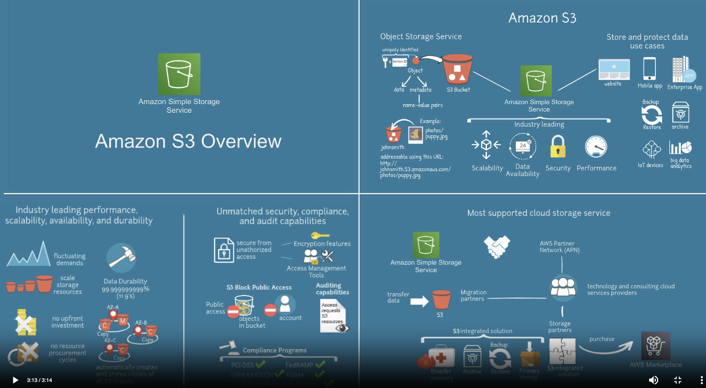
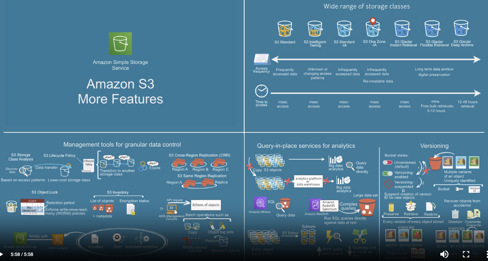

# S3

Bucket: 数据分为 数据和元数据, 元数据是用来描述数据的, 元数据是包含一系列键值对的数据
这些数据都存储在Bucket里面, 每一个在bucket 中的文件都有一个唯一地址来访问, 都会有一个URL

它具有:
Scalability
Data Availability
Security
Performance

S3 会自动创建存储对象的的副本这样在保护数据方面存在非常好的安全性.
S3 Block public access 实现自动对外提供访问服务
S3 支持PCI DSS, HIPAA/HITECH, RedRAMP, EU Data Protection Directive, FISMA 这些方式来控制访问权限和监管

权限管理:
默认是Private的只能够Owner访问.

通过编写 AccessPolicy 来授权给其他用户来读写.

这个AccessPolicy 分为两类: Resource-based Policy 和 User Policy

Resource-based Policy :
1.可以针对整个bucket进行访问限制
2.可以针对这个Bucket中的某类型的数据进行访问限制
3.还可以生成对某个资源临时访问的URL, 超时后就无效了

这种权限控制分为两部分:
    ACL (Access control list) 就是具体某个用户可以读写删等操作的限制, 一般都是通过界面设置
    Bucket Policies:  通过Json进行设置, 这个设置是针对整个bucket来做的.

User Policy: 针对用户来访问的权限, 就是AWS用户,或者AWS中其他应用的访问
1.AWS IAM Policy
这种权限控制就是针对AWS中的IAM(identity and Access Management) 的这部分设置的用户, 组, 角色等信息进行做限制.

更多功能:

S3 分为多种类型的Bucket:
S3 Standard : 经常用的就是这个
S3 Intelligent - Tiering : 在修改或者未知的访问模式情况下用
S3 Standard - IA : 访问频率较低的数据
S3 One Zone - IA : 访问频率较低, 但是在一个Zone里面才能用
S3 Glacier (这份三种, Instant Retrieval, Flexible Retrieval, Deep Archive) : 归档的数据 这三种也有对应的延迟行和高吞吐量的性质

可以选在S3 Cross-Region Replication (CRR):就是可以在不同Region做同步

S3 Object Lock: 可以锁住一些数据一段时间

S3 Inventory: 

S3 API:

S3 + AWS Lambda : 可以做一些报警, 数据归档,等自动化流程

S3 直接服务于Big Data Service
S3 可以跟RDS之间合作, 查询数据, 直接提供数据给大数据系统分享
S3 可以直接subset 里面的数据. 分类里面的数据,让S3来做分类自己的逻辑不用来做

S3 可以版本控制, 默认版本控制是关闭的,你可以打开, 一旦打开就关不上了.

